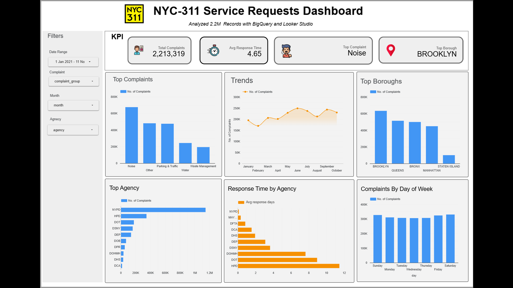

# 📊 NYC 311 Service Requests Analysis (Jan–Nov 2021)

## 📌 Project Overview
This project analyzes **~2.2M NYC 311 service requests (Jan–Nov 2021)** using **Google BigQuery** and **Looker Studio**.  
The goal was to identify complaint patterns, borough-level trends, agency response times, and provide actionable recommendations for city management.

---

## 🚀 Executive Summary
- **Noise complaints** = 30.5% of requests  
- **Brooklyn + Queens** = 51.9% of requests  
- **NYPD** handled 51.8% of cases with **fastest response** (0.07 days)  
- **Housing agency** was **slowest** (10.99 days vs city avg 4.65 days)  

✅ **Recommendations:**  
- Add staff in Brooklyn & Queens  
- Improve Housing agency efficiency  
- Replicate NYPD best practices  
- Adjust seasonal/weekend staffing  

---

## 🛠️ Tools Used
- **Google BigQuery** → SQL for cleaning & aggregation  
- **Google Looker Studio** → dashboard for visualization & insights  

---

## 📊 Methodology
1. Data Cleaning (null handling, date formatting, validating response times)  
2. Aggregation by complaint types, boroughs, and agencies  
3. Trend analysis (seasonal & weekly)  
4. Dashboard design in Looker Studio  

---

## 🔑 Key Findings
- **Complaint Patterns:** Noise (30.5%), Parking & Traffic (21.5%), Water (11.03%)  = ~63% of all requests  
- **Boroughs:** Brooklyn (28.3%) + Queens (23.6%) = 51.9%  
- **Agency Performance:** NYPD fastest (0.07 days), Housing slowest (10.99 days)  
- **Trends:** Seasonal spikes in summer, weekend complaint surges  

---

## 📈 Dashboard
👉 [View Interactive Dashboard](https://lookerstudio.google.com/s/n3tNCQ5nie8)  



---

## 📄 Report
The full report is available here:  
📑 [NYC 311 Report (PDF)](report/nyc311_report.pdf)

---

## 💻 SQL Queries
All analysis was performed in **BigQuery**.  
You can find the queries here:  
📂 [queries.sql](/queries.sql)

Example:

```sql
-- Complaint distribution by type
SELECT complaint_type, 
       COUNT(*) AS total_requests,
       ROUND(100 * COUNT(*) / SUM(COUNT(*)) OVER(), 2) AS pct_requests
FROM `nyc_311.requests`
GROUP BY complaint_type
ORDER BY total_requests DESC;
```

---

## 📚 References
- [NYC Open Data – 311 Service Requests](https://opendata.cityofnewyork.us/)  
- Google BigQuery Documentation  
- Google Looker Studio Documentation  

---

## 👤 Author
Prepared by: **Narasimha Kasu**
